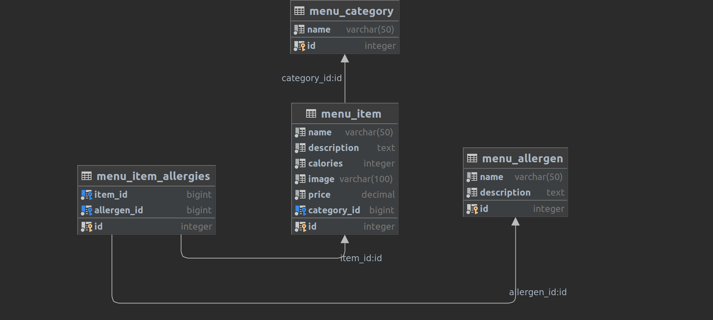

## Milestone 1: Describe Your Project
* It will be hosted on my PA account: `https://ileriodef.pythonanywhere.com/`
* It will be a simple application, like any generic online order menu. `https://www.mcdonalds.com/us/en-us/full-menu/burgers.html` for reference, excluding the design. 
* It will calculate the order's total calories, allergens, and price and then ask to proceed to the checkout.
* Every position in the menu will have a detailed view so the user can read more detailed information on the dish and look at the photos. 

## Milestone 2: Revised Description
* Nothing has changed drastically from the first milestone.
* So far, general model parameters are done. and could be seen on the image below

* T~~he design will be done with TailwindCSS~~
* The design will be done with Bootstrap 5
